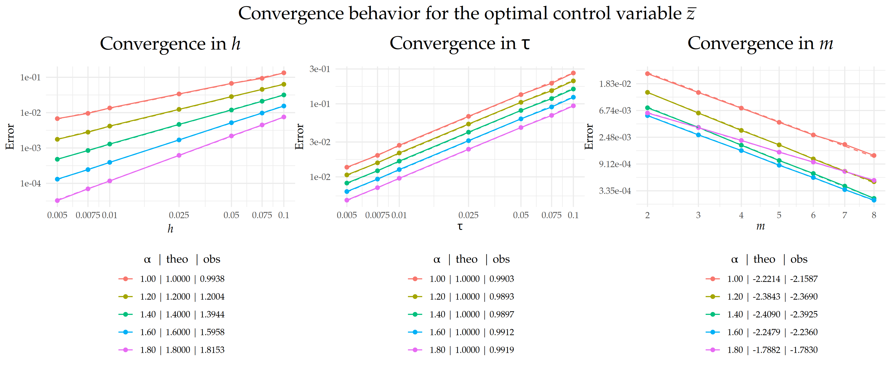
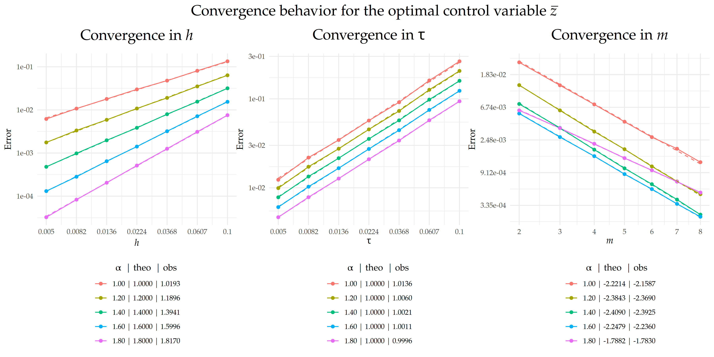

```{r setup, include=FALSE}
knitr::opts_chunk$set(echo = FALSE)
```


# Introduction

We analyze and numerically approximate solutions to fractional diffusion equations on metric graphs of the form
\begin{equation}
\label{eq:maineqfirstpart}
\tag{1}
\left\{
\begin{aligned}
    \partial_t u(s,t) + L^{\alpha/2} u(s,t) &= f(s,t), \\
    u(s,0) &= u_0(s), 
\end{aligned}
\right.
\end{equation}
where $L = \kappa^2 \! - \! \Delta_\Gamma$ and $u(\cdot,t)$ satisfies the Kirchhoff vertex conditions
\begin{equation}
\label{eq:Kcondfirstpart}
\tag{2}
   \textstyle\mathcal{K} =  \left\{\phi\in C(\Gamma)\;\middle|\; \forall v\in \mathcal{V}:\;  \sum_{e\in\mathcal{E}_v}\partial_e \phi(v)=0 \right\}.
\end{equation}
Here $\Gamma = (\mathcal{V},\mathcal{E})$ is a compact metric graph, $\kappa>0$, $\alpha\in(0,2]$ determines the smoothness of $u(\cdot,t)$, $\Delta_{\Gamma}$ is the so-called Kirchhoff--Laplacian. The fractional operator $L^{\alpha/2} : D(L^{\alpha/2}) \longmapsto L_2(\Gamma)$ is defined via
\begin{equation}
\label{lfractional}
\textstyle
         \phi \longmapsto L^{\alpha/2}\phi = \sum_{j\in\mathbb{N}}\lambda_j^{\alpha/2}(\phi, e_j)_{L_2(\Gamma)}e_j,
\end{equation}
and $-L^{\alpha/2}$ generates $T(t)\phi = \sum_{j\in\mathbb{N}}e^{-\lambda^{\alpha/2}_jt}\left(\phi, e_j\right)_{L_2(\Gamma)}e_j$. 

We interpret \eqref{eq:maineqfirstpart} as an abstract Cauchy problem in $L_2(\Gamma)$, given by
\begin{equation}
\label{eq:cauchyproblem}
\tag{3}
    \begin{cases}
    \partial_tu(t)+L^{\alpha/2}u(t)=f(t),\quad t\in (0, T),\\  
    u(0)=u_0\in D(L^{\alpha/2}).
\end{cases}
\end{equation}


**Theorem 1**.  If $f\in L_2((0,T);L_2(\Gamma))$  and $u_0\in \dot{H}^{\alpha}(\Gamma)$, then \eqref{eq:cauchyproblem} has a unique mild solution given by the variation of parameters formula
\begin{equation}
    \label{eq:mildsolution}
    u(t) = T(t)u_0 + \int_0^t T(t-r)f(r)dr,\quad t\geq 0.
\end{equation}


# Numerical Approximation

Let $\kappa=1$. For all $\phi\in V_h$ and $k=0,\dots, N-1$, the discrete scheme computes $U_h^{\tau}\subset V_h$, which solves
\begin{equation}
\label{system:fully_discrete_scheme}
\tag{4}
    \left\{
\begin{aligned}
    \langle\delta U_h^{k+1},\phi\rangle + \mathfrak{a}(
        U_h^{k+1},\phi) &= \langle f^{k+1},\phi\rangle, \\
    U^0_h &= P_hu_0, 
\end{aligned}
\right.
\end{equation}


The corresponding strong form of \eqref{system:fully_discrete_scheme} is given by
\begin{align}
\label{weak_form_m1}
\tag{5}
       \textstyle (I_{V_h}+\tau L_h^{\alpha/2})U_h^{k+1} = U_h^{k}+\tau f^{k+1}.
\end{align}
By applying $L_h^{-\alpha/2}$ to \eqref{weak_form_m1}, replacing $L_h^{-\alpha/2}$ with the rational approximation $r_m(L_h^{-1})$ $=$ $p_\ell(L_h)^{-1}p_r(L_h)$, and using the partial-fraction expansion $p_r(x)/(p_r(x)+\tau p_\ell(x))$ $=$ $\sum_{k=1}^{m+1}a_k(x-p_k)^{-1}$, we obtain 
<!-- \begin{align} -->
<!-- \tag{3} -->
<!-- \label{weak_form_m21} -->
<!--         (r_m(L_h^{-1})+\tau I_{V_h})U_{h,m}^{k+1}=r_m(L_h^{-1})(U_{h,m}^{k}+\tau f^{k+1}). -->
<!-- \end{align} -->
\begin{align}
\tag{6}
\label{weak_form_m4}
\textstyle
U_{h,m}^{k+1}= \left(\sum_{k=1}^{m+1}a_k(L_h-p_kI_{V_h})^{-1}\right) (U_{h,m}^{k}+\tau f^{k+1}),
\end{align}
or in matrix form,
\begin{align}
\label{thenumericalscheme}
\textstyle\mathbf{U}_{k+1} = \mathbf{R}(\mathbf{C}\mathbf{U}_k+\tau \mathbf{F}_{k+1}),\quad \mathbf{R} = \sum_{k=1}^{m+1} a_k\left(\mathbf{L}-p_k\mathbf{C}\right)^{-1}.
\end{align}

**Theorem 2**. Let $u$ be the solution to \eqref{eq:maineqfirstpart} and $U^{\tau}_{h,m}\subset V_h$ solve the weak form of \eqref{weak_form_m4}. If $f\in L_\infty((0,T);L_2(\Gamma))$ and $u_0\in\dot{H}^{\alpha}(\Gamma)$, then

::: {.custom-box}

\begin{align}
    \label{finalfinalestfirstpart}
        \norm{u-U_{h,m}^\tau}_{L_2(\Gamma\times(0,T))}\lesssim\tau+h^\alpha +  h^{\alpha-2}e^{-2\pi\sqrt{(1-\alpha/2)m}}.
\end{align}

:::

```{r, echo=FALSE, fig.align='center', fig.cap="Comparison between theoretical and observed convergence behavior for the error $\\|u- U_{h,m}^\\tau\\|_{L_2(\\Gamma\\times(0,T))}$ with respect to $h$, $\\tau$, and $m$, where $\\Gamma$ is the tadpole graph. The left and center plots display the convergence rates in $h$ and $\\tau$, respectively, on a $\\text{log}_{10}$–$\\text{log}_{10}$ scale, while the right plot shows the exponential decay in $m$ on a semi-$\\text{log}_{e}$ scale, with $m$ plotted on a square-root scale. Dashed lines indicate the theoretical rates, and solid lines represent the observed error curves. The legend below each plot shows the value of $\\alpha$ along with the corresponding theoretical ('theo'), and observed ('obs') rates for each case.", out.width='100%'}
# figures

```


# Optimal Control Problem

Let $u_d$ be the desired state, $z$ denote the control variable, and  $\mu>0$ a regularization parameter. We are concerned with the following PDE-constrained optimization problem: Find
\begin{equation}
\label{eq:min_pro}
\tag{7}
    \min\; J(u, z)=  \frac{1}{2} \int_0^T\left(\left\|u-u_d\right\|_{L_2(\Gamma)}^2+\mu\|z\|_{L_2(\Gamma)}^2\right) dt
\end{equation}
subject to the fractional diffusion equation \eqref{eq:maineqfirstpart} with right-hand side $f+z$,
<!-- \begin{equation} -->
<!-- \tag{8} -->
<!-- \label{eq:maineq} -->
<!-- \left\{ -->
<!-- \begin{aligned} -->
<!--     \partial_t u(s,t) + (\kappa^2 \! - \! \Delta_\Gamma)^{\alpha/2} u(s,t) &= f(s,t)+z(s,t), \\ -->
<!--     u(s,0) &= u_0(s), -->
<!-- \end{aligned} -->
<!-- \right. -->
<!-- \end{equation} -->
where $u$ satisfies the Kirchhoff vertex conditions \eqref{eq:Kcondfirstpart}, and $z$ satisfies the control constraints 
\begin{align}
\tag{9}
\label{control_constraints}
    a(s,t)\leq z(s,t)\leq b(s,t)\;\almosteverywhere (s,t)\in\Gamma \times(0, T).
\end{align}
Associated to $u = u(z)$, the adjoint state $p=p(z)$ solves
\begin{equation}
\tag{10}
\label{eq:adjointeq}
\left\{
\begin{aligned}
    \!-\partial_t p(s,t)\! + \! (\kappa^2 \! - \! \Delta_\Gamma)^{\alpha/2} p(s,t) &= \! u(s,t) \! - \! u_d(s,t),\\
    p(s,T) &= \! 0.
\end{aligned}
\right.
\end{equation}


The optimal control variable $\bar{z}$ is related to the optimal adjoint state $\bar{p}$ via the projection formula
\begin{align}
\tag{11}
\label{proj_formula}
    \bar{z}  = \min\left\{b ,\max\left\{a ,-\bar{p}/\mu \right\}\right\}.
\end{align}


**Theorem 3**. Let $\bar{z}$ be the optimal control of problem \eqref{eq:min_pro}-\eqref{control_constraints} and $\bar{Z}_{h,m}^\tau$ be the optimal discrete control. If $f,u_d\in L_\infty((0,T);L_2(\Gamma))$ and $u_0\in\dot{H}^{\alpha}(\Gamma)$, then

::: {.custom-box}

\begin{align}
  \norm{\bar{z}- \bar{Z}_{h,m}^\tau}_{L_2(\Gamma\times(0,T))}\lesssim \tau+h^\alpha+ h^{\alpha-2}e^{-2\pi\sqrt{(1-\alpha/2)m}}.
\end{align}

:::

# FBSM Algorithm

At a high level, FBSM follows these steps.

a. *Initialization:* Choose an initial approximation for $\bar{z}$. 
b. *State solve:* Using $\bar{z}$, solve \eqref{eq:maineqfirstpart} with RHS $f+\bar{z}$ to obtain $\bar{u}$. 
c. *Adjoint solve:* Using $\bar{u}$, solve \eqref{eq:adjointeq} to obtain $\bar{p}$. 
d. *Control update:* Update $\bar{z}$ via the projection formula \eqref{proj_formula}. 
e. *Iteration:* Repeat steps b - d until convergence. 

The fully discrete and vectorized form is given by
<!-- \begin{align} -->
<!-- \label{iterationvectorizedversion} -->
<!-- \begin{cases} -->
<!--      (1) \text{ Initialize } \mathbf{\bar{z}},\\ -->
<!--     (2) \text{ Compute }\mathbf{\bar{u}} = \mathbf{h} + \mathbf{S}_{\mathrm{F}}\mathbf{\hat{R}}(\mathbf{f}+\mathbf{M}\mathbf{\bar{z}}),\\ -->
<!--     (3) \text{ Compute }\mathbf{\bar{p}}  = \mathbf{S}_{\mathrm{B}}\mathbf{\hat{R}}(\mathbf{M}\mathbf{\bar{u}} - \mathbf{d}),\\ -->
<!--     (4)\text{ Update }\mathbf{\bar{z}}  = \max\{\mathbf{a}, \min\{\mathbf{b}, -\mathbf{\bar{p}}/\mu\}\},\\ -->
<!--     (5)\text{ Repeat }(2) - (4) \text{ until convergence}. -->
<!--      \end{cases} -->
<!-- \end{align} -->

1. Initialize $\mathbf{\bar{z}}$,
2. Compute $\mathbf{\bar{u}} = \mathbf{h} + \mathbf{S}_{\mathrm{F}}\mathbf{\hat{R}}(\mathbf{f}+\mathbf{M}\mathbf{\bar{z}})$,
3. Compute $\mathbf{\bar{p}}  = \mathbf{S}_{\mathrm{B}}\mathbf{\hat{R}}(\mathbf{M}\mathbf{\bar{u}} - \mathbf{d})$,
4. Update $\mathbf{\bar{z}}  = \max\{\mathbf{a}, \min\{\mathbf{b}, -\mathbf{\bar{p}}/\mu\}\}$,
5. Repeat 2 - 4 until convergence.

Let $\Pi(\mathbf{x}) := \max\{\mathbf{a}, \min\{\mathbf{b}, -\mathbf{x}/\mu\}\}$. Then the control update can be expressed as
\begin{align*}
    \mathbf{\bar{z}}  = \underbrace{\Pi(\mathbf{S}_{\mathrm{B}}\mathbf{\hat{R}}(\mathbf{M}(\mathbf{h} + \mathbf{S}_{\mathrm{F}}\mathbf{\hat{R}}(\mathbf{f}+\mathbf{M}\mathbf{\bar{z}})) - \mathbf{d}))}_{\mathfrak{T}(\mathbf{\bar{z}})},
\end{align*}
which leads to the fixed-point formulation $\mathbf{\bar{z}}^{(n+1)}  = \mathfrak{T}(\mathbf{\bar{z}}^{(n)})$.


**Proposition 1**. If $\mu\kappa^{2\alpha}>1$, then $\mathfrak{T}$ is a contraction and $(\mathbf{\bar{z}}^{(n)})_{n\in\mathbb{N}}$ converges to a unique fixed point $\mathbf{\bar{z}}^\star$, which uniquely determines the optimal state via $\mathbf{\bar{u}}^{\star} = \mathbf{h} + \mathbf{S}_{\mathrm{F}}\mathbf{\hat{R}}(\mathbf{f}+\mathbf{M}\mathbf{\bar{z}}^{\star})$.

```{r, echo=FALSE, fig.align='center', fig.cap="Comparison between theoretical and observed convergence behavior for the error $\\|\\bar{z}- \\bar{Z}_{h,m}^\\tau\\|_{L_2(\\Gamma\\times(0,T))}$ with respect to $h$, $\\tau$, and $m$.", out.width='100%'}
# figures

```

_____


```{r, fig.align='center', out.width='25%', fig.cap = "Visit https://leninrafaelrierasegura.github.io/NAFDEMG/ for more information."}
library(qrcode)
# Generate QR code
myqrcode <- qr_code("https://leninrafaelrierasegura.github.io/NAFDEMG/about.html") 
plot(myqrcode)
```


