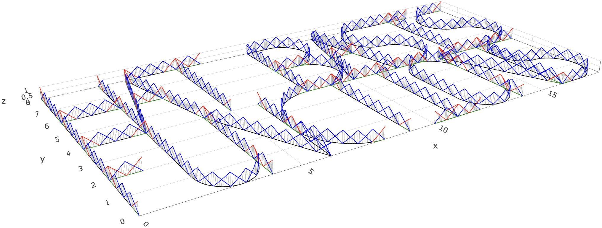

```{r, load_refs, include=FALSE, cache=FALSE}
library(RefManageR)
BibOptions(check.entries = FALSE,
           bib.style = "authoryear",
           cite.style = "alphabetic",
           style = "markdown",
           hyperlink = FALSE,
           dashed = FALSE)
myBib <- ReadBib("./presentation_ref.bib", check = FALSE)
```

```{r setup, echo = FALSE}
options(htmltools.dir.version = FALSE)
library(xaringanthemer)
style_mono_accent(base_color = "#0D2244")
htmltools::tagList(
  xaringanExtra::use_clipboard(
    button_text = "<i class=\"fa-solid fa-clipboard\" style=\"color: #00008B\"></i>",
    success_text = "<i class=\"fa fa-check\" style=\"color: #90BE6D\"></i>",
    error_text = "<i class=\"fa fa-times-circle\" style=\"color: #F94144\"></i>"
  ),
  rmarkdown::html_dependency_font_awesome()
)
knitr::opts_chunk$set(
  message = FALSE,    
  warning = FALSE,    
  echo = FALSE,        
  include = TRUE,     
  eval = TRUE,       
  cache = FALSE,       
  fig.align = "center",
  out.width = "90%",
  dpi = 300,
  error = TRUE,
  collapse = TRUE
)

fig_count <- 0
# Define the captioner function
captioner <- function(caption) {
  fig_count <<- fig_count + 1
  paste0("Figure ", fig_count, ": ", caption)
}
```


class: center, middle

<!-- <div style="position:absolute; top:40px; right:55px;"> -->
<!--    -->
<!-- </div> -->

<div style="position:absolute; top:40px; right:55px;">
  
  
  
</div>


# Part I


#### Numerical Analysis

---

class: left, top

<div style="position:absolute; top:40px; right:55px;">
  
  
  
</div>

## Problem setting
*********

We analyze and numerically approximate solutions to fractional diffusion equations on metric graphs of the form

.content-box-gray[
$$
\begin{cases}
  \partial_t u(s,t) + (\kappa^2 - \Delta_\Gamma)^{\alpha/2} u(s,t) & = f(s,t), \quad (s,t) \in \Gamma \times (0, T), \\
  u(s,0) & = u_0(s), \quad s \in \Gamma,
\end{cases}
\tag{1}
$$
]

with $u(\cdot,t)$ satisfying the Kirchhoff vertex conditions

\begin{equation}
\label{eq:Kcondfirstpart}
\tag{2}
   \mathcal{K} =  \left\{\phi\in C(\Gamma)\;\middle|\; \forall v\in \mathcal{V}:\;  \sum_{e\in\mathcal{E}_v}\partial_e \phi(v)=0 \right\}.
\end{equation}

Here $\Gamma = (\mathcal{V},\mathcal{E})$ is a compact metric graph, $\kappa>0$, $\alpha\in(0,2]$ determines the smoothness of $u(\cdot,t)$, $\Delta_{\Gamma}$ is the so-called Kirchhoff-Laplacian.

---

class: left, top

<div style="position:absolute; top:40px; right:55px;">
  
  
  
</div>

## Problem setting
*********

- For $\kappa>0$, we define the operator $L:D(L) = D(\Delta_{\Gamma})\to L_2(\Gamma)$ as the shifted Kirchhoff--Laplacian $L =\kappa^2 -\Delta_{\Gamma}$, which is densely-defined in $L_2(\Gamma)$, selfadjoint, and positive definite with a compact inverse, ensuring a well-posed spectral decomposition `r Cite(myBib, "berkolaiko2013introduction", "bolin2024gaussian")`.

The fractional operator $L^{\alpha/2} : D(L^{\alpha/2}) \longmapsto L_2(\Gamma)$ is defined via

\begin{equation}
\label{lfractional}
         \phi \longmapsto L^{\alpha/2}\phi = \sum_{j\in\mathbb{N}}\lambda_j^{\alpha/2}(\phi, e_j)_{L_2(\Gamma)}e_j
\end{equation}

and $-L^{\alpha/2}$ generates

\begin{align}
\label{spectral_semigroup}
    T(t)\phi = \sum_{j\in\mathbb{N}}e^{-\lambda^{\alpha/2}_jt}\left(\phi, e_j\right)_{L_2(\Gamma)}e_j.
\end{align}

---

class: left, top

<div style="position:absolute; top:40px; right:55px;">
  
  
  
</div>

## Existence and uniqueness
*********

We interpret $(1)$ as an abstract Cauchy problem in $L_2(\Gamma)$, given by

.content-box-gray[
$$
\begin{cases}
    \partial_tu(t)+L^{\alpha/2}u(t)=f(t),\quad t\in (0, T),\\  
    u(0)=u_0\in D(L^{\alpha/2}).
\end{cases}
\tag{3}
$$
]


<div class="content-box-myblue">
Theorem 1
</div>

.content-box-gray[
If $f\in L_2(\Gamma\times(0,T))$  and $u_0\in \dot{H}^{\alpha}(\Gamma)$, then $(3)$ has a unique mild solution given by the variation of parameters formula
\begin{equation}
    \label{eq:mildsolution}
    u(t) = T(t)u_0 + \int_0^t T(t-r)f(r)dr,\quad t\geq 0.
\end{equation}
]

---

class: left, top

<div style="position:absolute; top:40px; right:55px;">
  
  
  
</div>

## Discretization | Space
*********


```{r, echo=FALSE, fig.align='center', fig.cap=captioner("Illustration of the basis function system $\\{\\psi^i_h\\}_{i=1}^{N_h}$ on the hat-basis-functions graph (in black). Standard hat functions associated with internal edge nodes are shown in blue, while special vertex-centered functions are highlighted in red. The star-shaped structures around the vertices are shown in green."), out.width='90%'}
# figures

```


---

class: left, top

<div style="position:absolute; top:40px; right:55px;">
  
  
  
</div>

## Discretization | Time
*********

- Backward Euler scheme

- To discretize the time domain, we divide the interval $[0, T]$ into $N$ uniform subintervals with time steps $t_k = k\tau,\; k = 0, \dots, N$, where $\tau = T/N$ is the time step size. For a continuous function $\phi\in C([0,T];X)$, we denote its $X$-value at $t_k$ by $\phi^k=\phi(t_k)$ and let $\phi^\tau$ denote the sequence of evaluations $\{\phi^k\}_{k=0}^N$ at the time step sequence $\{t_k\}_{k=0}^N$. For any sequence $\phi^\tau$, we let $\tilde{\phi}^\tau$ represent the piecewise constant function given by
$$
\begin{cases}
 \tilde{\phi}^\tau(0) = \phi^0\\
\tilde{\phi}^\tau(t) = \phi^k,\quad t\in(t_{k-1},t_k],\quad k=1,\dots, N.
\end{cases}
$$


---

class: left, top

<div style="position:absolute; top:40px; right:55px;">
  
  
  
</div>

## Discrete Operator
*********

<div class="content-box-myblue">
Definition 1
</div>

.content-box-gray[
For $\alpha\in[0,2]$, we define the discrete version of $L^{\alpha/2}$ as $L_h^{\alpha/2}:V_h\to V_h$ via 
$$(L_h^{\alpha/2}\phi_h,\psi_h)_{L_2(\Gamma)} = \mathfrak{a}(\phi_h, \psi_h),\quad \phi_h,\psi_h\in V_h,\tag{4}$$ where the bilinear form $\mathfrak{a}:\dot{H}^{\alpha/2}(\Gamma)\times \dot{H}^{\alpha/2}(\Gamma)\to \mathbb{R}$ is defined by
$$\mathfrak{a}(\phi,\psi) := (L^{\alpha/4}\phi,L^{\alpha/4}\psi)_{L_2(\Gamma)}, \quad \phi,\psi\in\dot{H}^{\alpha/2}(\Gamma).$$
]

Weak form of $(1)$: Find $u$ such that
$$
\begin{cases}
    \langle\partial_tu,\phi\rangle + \mathfrak{a}(u,\phi) &= \langle f,\phi\rangle,\quad\forall \phi\in \dot{H}^{\alpha/2}(\Gamma),\quad \text{a.e. } t\in(0,T),\\  
    u(0)&=u_0.
\end{cases}
\tag{5}
$$

---

class: left, top

<div style="position:absolute; top:40px; right:55px;">
  
  
  
</div>

## Approximation | time-level
*********

Let $\alpha>0$ and $U^\tau$ denote the sequence of approximations of the solution to problem $(5)$ at each time step. The scheme computes $U^{\tau}\subset\dot{H}^{\alpha/2}(\Gamma)$, which solves
$$
\begin{cases}
    \langle\delta U^{k+1},\phi\rangle + \mathfrak{a}(U^{k+1},\phi)  &= \langle f^{k+1},\phi\rangle , \quad\forall\phi\in \dot{H}^{\alpha/2}(\Gamma),\quad k=0,\dots, N-1, \\
    U^0 &= u_0.
\end{cases}
\tag{6}
$$

<div class="content-box-myblue">
Theorem 2
</div>

.content-box-gray[
Let $\alpha>0$ and $u$ be the solution to $(5)$. Let $\tilde{U}^\tau$ be the piecewise constant function constructed from the solution to $(6)$. If $f\in L_\infty(\Gamma\times(0,T))$ and $u_0\in\dot{H}^{\alpha/2}(\Gamma)$, then
$$\|u-\tilde{U}^\tau\|_{L_2(\Gamma\times(0,T))}\lesssim \tau \left(\|u_0\|_{\dot{H}^{\alpha/2}(\Gamma)}+\|f\|_{L_\infty(\Gamma\times(0,T))}\right).$$
]

---

class: left, top

<div style="position:absolute; top:40px; right:55px;">
  
  
  
</div>

## Approximation | space-level
*********


Let $\alpha\in(0,2]$ and $U_h^\tau$ denote the sequence of approximations of the solution to problem $(5)$ at each time step on a mesh indexed by $h$. The scheme computes $U_h^{\tau}\subset V_h$, which solves
$$
\begin{cases}
    \langle\delta U_h^{k+1},\phi\rangle + \mathfrak{a}(
        U_h^{k+1},\phi) &= \langle f^{k+1},\phi\rangle, \quad\forall\phi\in V_h,\quad k=0,\dots, N-1, \\
    U^0_h &= P_hu_0, 
\end{cases}
\tag{7}
$$

<div class="content-box-myblue">
Theorem 3
</div>

.content-box-gray[
Let $\alpha\in[0,2]$ and $U^\tau$ and $U_h^\tau$ be the solutions to $(6)$ and $(7)$, respectively. If $f\in L_2(\Gamma\times(0,T))$ and $u_0\in\dot{H}^{\alpha}(\Gamma)$, then
$$\|U^\tau-U_h^\tau\|_{\ell^2(L_2(\Gamma))}\lesssim h^{\alpha}\left(\|u_0\|_{\dot{H}^{\alpha}(\Gamma)} + \|f^\tau\|_{\ell^2(L_2(\Gamma))}\right).$$
]


---

class: left, top

<div style="position:absolute; top:40px; right:55px;">
  
  
  
</div>

## Approximation | rational approx-level | 1
*********

The corresponding strong form of $(7)$ is given by
$$(I_{V_h}+\tau (\kappa^{2})^{\alpha/2}(L_h/\kappa^2)^{\alpha/2})U_h^{k+1} = U_h^{k}+\tau f^{k+1}.\tag{8}$$
Let $\beta = \alpha/2$. Applying $(L_h/\kappa^2)^{-\beta}$ to $(8)$ yields 
$$((L_h/\kappa^2)^{-\beta}+\tau \kappa^{2\beta} I_{V_h})U_h^{k+1}=(L_h/\kappa^2)^{-\beta}(U_h^{k}+\tau f^{k+1}),\tag{9}$$
We now consider a rational approximation of $(L_h/\kappa^2)^{-\beta}$ of the form 
$$r_m((L_h/\kappa^2)^{-1})= p_\ell(L_h/\kappa^2)^{-1}p_r(L_h/\kappa^2),\tag{10}$$
Replacing the rational approximation of $(L_h/\kappa^2)^{-\beta}$ in $(9)$ yields 
$$(r_m((L_h/\kappa^2)^{-1})+\tau \kappa^{2\beta} I_{V_h})U_{h,m}^{k+1}=r_m((L_h/\kappa^2)^{-1})(U_{h,m}^{k}+\tau f^{k+1}),\tag{11}$$
where the subindex $m$ indicates the dependence of the solution on the degree of the rational approximation.

---

class: left, top

<div style="position:absolute; top:40px; right:55px;">
  
  
  
</div>

## Approximation | rational approx-level | 2
*********

<div class="content-box-myblue">
Theorem 4
</div>

.content-box-gray[
Let $\alpha\in[0,2]$ and $u$ be the solution to $(5)$. Assume further that for $k=0,\dots,N-1$, $U^{k+1}_{h,m}\in V_h$ solves the weak form of $(11)$ with $U^{0}_{h,m}= U^{0}_{h}$. If $f\in L_\infty((0,T);L_2(\Gamma))$ and $u_0\in\dot{H}^{\alpha}(\Gamma)$, then
$$\|u-U_{h,m}^\tau\|_{L_2((0,T);L_2(\Gamma))}\lesssim\tau+h^\alpha + h^{\alpha-2}e^{-2\pi\sqrt{(1-\alpha/2)m}},\tag{12}$$
where the hidden constant depends on $\|u_0\|_{L_2(\Gamma)} +\|f\|_{L_\infty((0,T);L_2(\Gamma))}$.
]

---

class: left, top

<div style="position:absolute; top:40px; right:55px;">
  
  
  
</div>

## Matrix representation | 1
*********


To derive the matrix representation of the numerical scheme, we first use $(10)$ to rewrite $(11)$ as
$$(p_r(L_h/\kappa^2)+\tau \kappa^{2\beta}p_\ell(L_h/\kappa^2))U_{h,m}^{k+1}= p_r(L_h/\kappa^2) (U_{h,m}^{k}+\tau f^{k+1}).\tag{13}$$
We can now go one step further and isolate the numerical solution at time $t_{k+1}$ by consider the following partial fraction decomposition 
$$\dfrac{p_r(x)}{p_r(x)+\tau \kappa^{2\beta}p_\ell(x)} =  \sum_{k=1}^{m+1}a_k(x-p_k)^{-1} + r,\tag{14}$$
where $\{a_k\}_{k=1}^{m+1}$ and $\{p_k\}_{k=1}^{m+1}$ are the residues and poles, respectively, and $r$ denotes the remainder. Substituting this into $(13)$ gives the iteration rule
$$U_{h,m}^{k+1}= \left(\sum_{k=1}^{m+1}a_k(L_h/\kappa^2-p_kI_{V_h})^{-1} + rI_{V_h}\right) (U_{h,m}^{k}+\tau f^{k+1}).\tag{15}$$


---

class: left, top

<div style="position:absolute; top:40px; right:55px;">
  
  
  
</div>

## Matrix representation | 2
*********


Substituting the expansion $U_h^k(s) =  \sum_{i=1}^{N_h}u_i^k\psi^i_h(s)$, $s\in\Gamma$ into the weak form $(15)$ yields the following matrix iteration
$$\mathbf{U}_{k+1} = \mathbf{C}^{-1}\left(\sum_{k=1}^{m+1} a_k\left(\mathbf{L}\mathbf{C}^{-1}/\kappa^2-p_k\mathbf{I}_{N_h}\right)^{-1} + r\mathbf{I}_{N_h}\right) (\mathbf{C}\mathbf{U}_k+\tau \mathbf{F}_{k+1}),\tag{16}$$
where $\mathbf{L} = \kappa^2\mathbf{C}+\mathbf{G}$, the matrix $\mathbf{C}\in\mathbb{R}^{N_h\times N_h}$ has entries $\mathbf{C}_{i,j} = (\psi^i_h,\psi^j_h)_{L_2(\Gamma)}$, $\mathbf{G}\in\mathbb{R}^{N_h\times N_h}$ has entries $\mathbf{G}_{i,j} = ({\psi^{i}_h}',{\psi^{j}_h}')_{L_2(\Gamma)}$, $\mathbf{U}_k\in\mathbb{R}^{N_h}$ has entries $u_i^k$, and $\mathbf{F}_k\in\mathbb{R}^{N_h}$ has components $(f^{k},\psi^i_h)_{L_2(\Gamma)}$. 

In practice, since the rational function in $(14)$ is proper, there is no remainder $r$. Moreover, since $( \mathbf{L}\mathbf{C}^{-1}/\kappa^2-p_k\mathbf{I}_{N_h})^{-1}  = \mathbf{C}(\mathbf{L}/\kappa^2-p_k\mathbf{C})^{-1}$, scheme $(16)$ reduces to
$$\mathbf{U}_{k+1} = \mathbf{R}(\mathbf{C}\mathbf{U}_k+\tau \mathbf{F}_{k+1}),\quad \mathbf{R} = \sum_{k=1}^{m+1} a_k\left(\mathbf{L}/\kappa^2-p_k\mathbf{C}\right)^{-1}\tag{17}$$
where it is evident that only sparse solves are required.

---

class: left, top

<div style="position:absolute; top:40px; right:55px;">
  
  
  
</div>

## References
*********

```{r refs, echo=FALSE, results="asis"}
PrintBibliography(myBib, .opts = list(bib.style = "alphabetic"))
```


